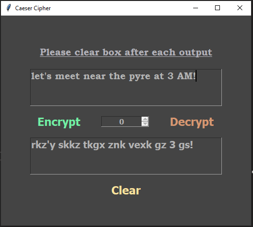
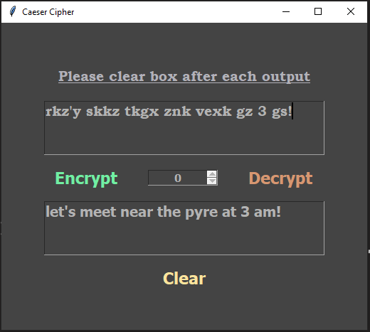

# Caeser-Cipher
A Caesar Cipher program implemented using GUI

### Written in python 3.9 

## Installation on Windows:
* `git clone https://github.com/snehangsude/Caesar-Cipher.git`
* `cd Caesar-Cipher`
* `python main.py`

## Installation on Linux and Unix like OS:
* `git clone https://github.com/snehangsude/Caesar-Cipher.git`
* `cd Caesar-Cipher`
* `python main.py`

## Interface Images

* #### Initial screen

* #### Encrypted message

* #### Decrypted message

## How to use

* Run the application using the Installation section
* Enter the text as shown in the images 
* The Spin box is being set to 10000 as max if you move using mouse button - you can also enter a number manually there
* Remember the spin to decrypt

### Improvements planned

* Capitalizing the first letter after a sentence starts
* Spin to be added to numerical numbers too 
