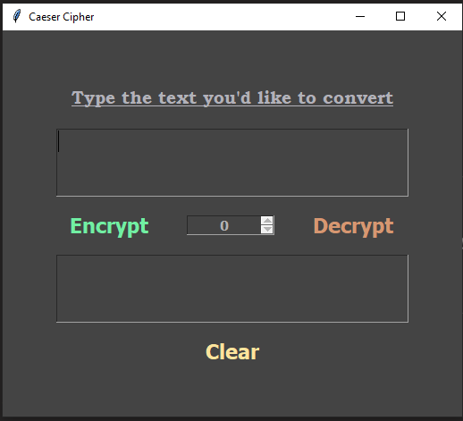
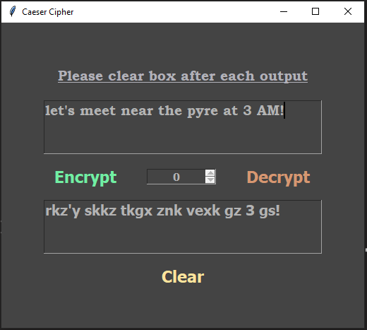
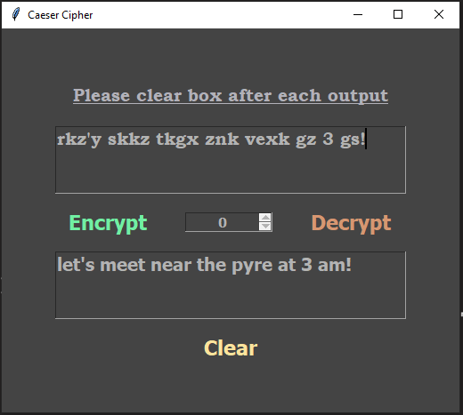

# Caeser-Cipher
A Caesar Cipher program implemented using GUI

### Written in python 3.9 

## Installation on Windows:
* `git clone https://github.com/snehangsude/Caesar-Cipher.git`
* `cd Caesar-Cipher`
* `python main.py`

## Installation on Linux and Unix like OS:
* `git clone https://github.com/snehangsude/Caesar-Cipher.git`
* `cd Caesar-Cipher`
* `python main.py`

## Interface Images

* #### Initial screen

* #### Encrypted message

* #### Decrypted message

